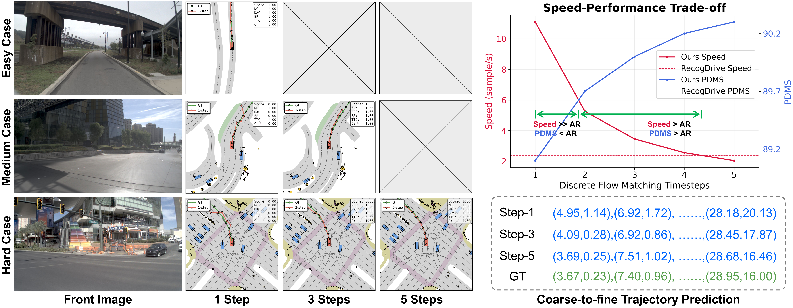
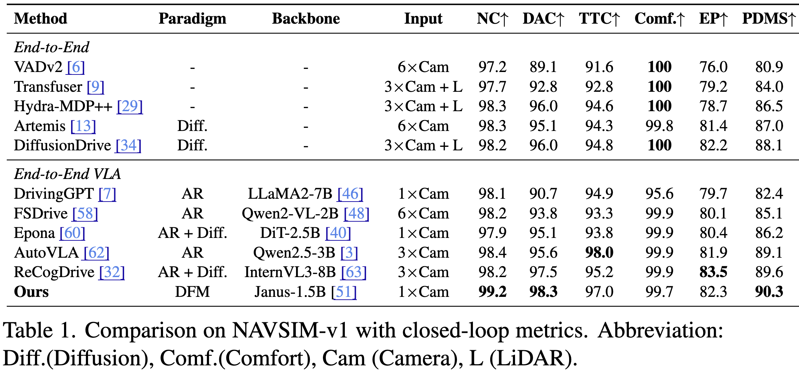
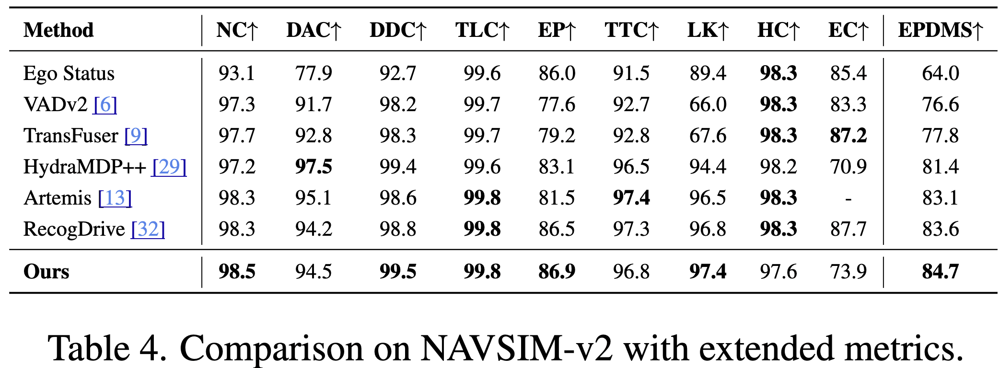
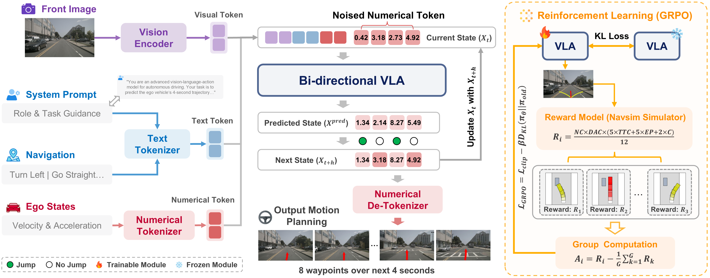

<h1 align='center'>WAM-Flow: Parallel Coarse-to-Fine Motion Planning via Discrete Flow Matching for Autonomous Driving</h1>
<div align='center'>
    <a href='https://github.com/YoucanBaby' target='_blank'>Yifang Xu</a><sup>1*</sup>&emsp;
    <a href='https://cuijh26.github.io/' target='_blank'>Jiahao Cui</a><sup>1*</sup>&emsp;
    <a href='https://github.com/fudan-generative-vision/WAM-Flow' target='_blank'>Feipeng Cai</a><sup>2*</sup>&emsp;
    <a href='https://github.com/SSSSSSuger' target='_blank'>Zhihao Zhu</a><sup>1</sup>&emsp;
    <a href='https://github.com/NinoNeumann' target='_blank'>Hanlin Shang</a><sup>1</sup>&emsp;
    <a href='https://github.com/isan089' target='_blank'>Shan Luan</a><sup>1</sup>&emsp;
</div>
<div align='center'>
    <a href='https://github.com/xumingw' target='_blank'>Mingwang Xu</a><sup>1</sup>&emsp;
    <a href='https://github.com/fudan-generative-vision/WAM-Flow' target='_blank'>Neng Zhang</a><sup>2</sup>&emsp;
    <a href='https://github.com/fudan-generative-vision/WAM-Flow' target='_blank'>Yaoyi Li</a><sup>2</sup>&emsp;
    <a href='https://github.com/fudan-generative-vision/WAM-Flow‘ target='_blank'>Jia Cai</a><sup>2</sup>&emsp;
    <a href='https://sites.google.com/site/zhusiyucs/home' target='_blank'>Siyu Zhu</a><sup>1</sup>&emsp;
</div>

<div align='center'>
    <sup>1</sup>Fudan University&emsp; <sup>2</sup>Yinwang Intelligent Technology Co., Ltd&emsp;
</div>

<br>
<div align='center'>
    <a href='https://github.com/fudan-generative-vision/WAM-Flow'></a>
    <a href='https://arxiv.org/abs/2512.06112'></a>
    <a href='https://huggingface.co/fudan-generative-ai/WAM-Flow'></a>
</div>
<br>

## 📰 News

- **`2025/12/06`**: 🎉🎉🎉 Paper submitted on [Arxiv](https://arxiv.org/pdf/2512.06112).

## 📅️ Roadmap

| Status | Milestone                                                                                             |    ETA     |
| :----: | :----------------------------------------------------------------------------------------------------: | :--------: |
|   🚀   | **[Releasing the inference source code](https://github.com/fudan-generative-vision/WAM-Flow)** | 2025.12.21        |
|   🚀   | **[Pretrained models on Huggingface](https://huggingface.co/fudan-generative-ai/WAM-Flow)**              | TBD        |
|   🚀   | **[Releasing the training scripts](#training)**                                                          | TBD        |


## 📸 Showcase


## 🏆 Qualitative Results on NAVSIM



## 🔧️ Framework


## 📝 Citation

If you find our work useful for your research, please consider citing the paper:

```
@article{xu2025wam,
  title={WAM-Flow: Parallel Coarse-to-Fine Motion Planning via Discrete Flow Matching for Autonomous Driving},
  author={Xu, Yifang and Cui, Jiahao and Cai, Feipeng and Zhu, Zhihao and Shang, Hanlin and Luan, Shan and Xu, Mingwang and Zhang, Neng and Li, Yaoyi and Cai, Jia and others},
  journal={arXiv preprint arXiv:2512.06112},
  year={2025}
}
```

## ⚠️ Social Risks and Mitigations

The development of portrait image animation technologies driven by audio inputs poses social risks, such as the ethical implications of creating realistic portraits that could be misused for deepfakes. To mitigate these risks, it is crucial to establish ethical guidelines and responsible use practices. Privacy and consent concerns also arise from using individuals' images and voices. Addressing these involves transparent data usage policies, informed consent, and safeguarding privacy rights. By addressing these risks and implementing mitigations, the research aims to ensure the responsible and ethical development of this technology.

## 🤗 Acknowledgements
We gratefully acknowledge the contributors to the [Janus](https://github.com/deepseek-ai/Janus), [FUDOKI](https://github.com/fudoki-hku/FUDOKI) and [flow_matching](https://github.com/facebookresearch/flow_matching) repositories, whose commitment to open source has provided us with their excellent codebases and pretrained models.